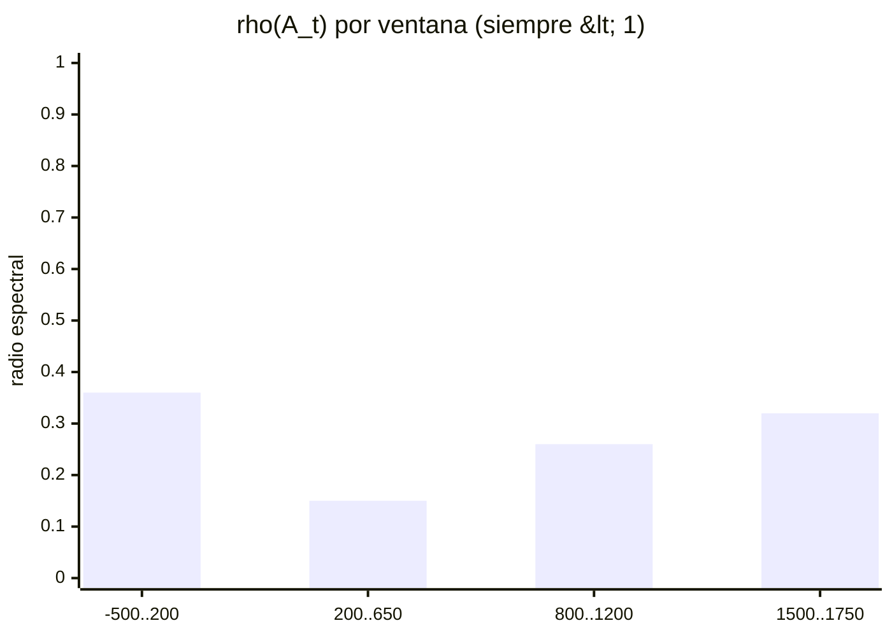
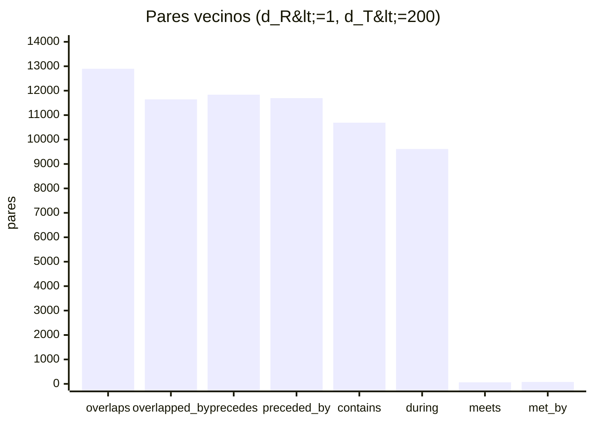
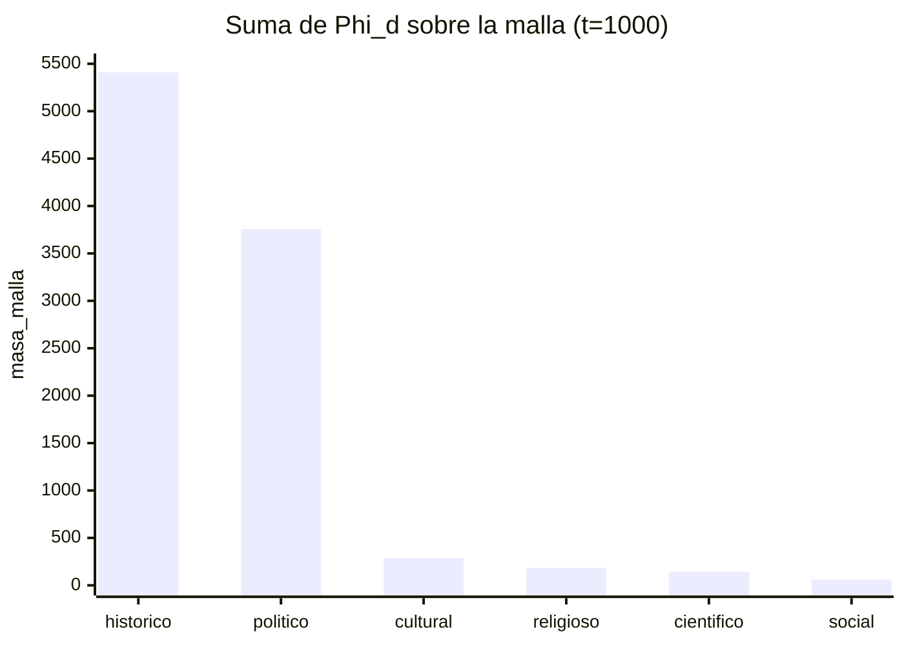
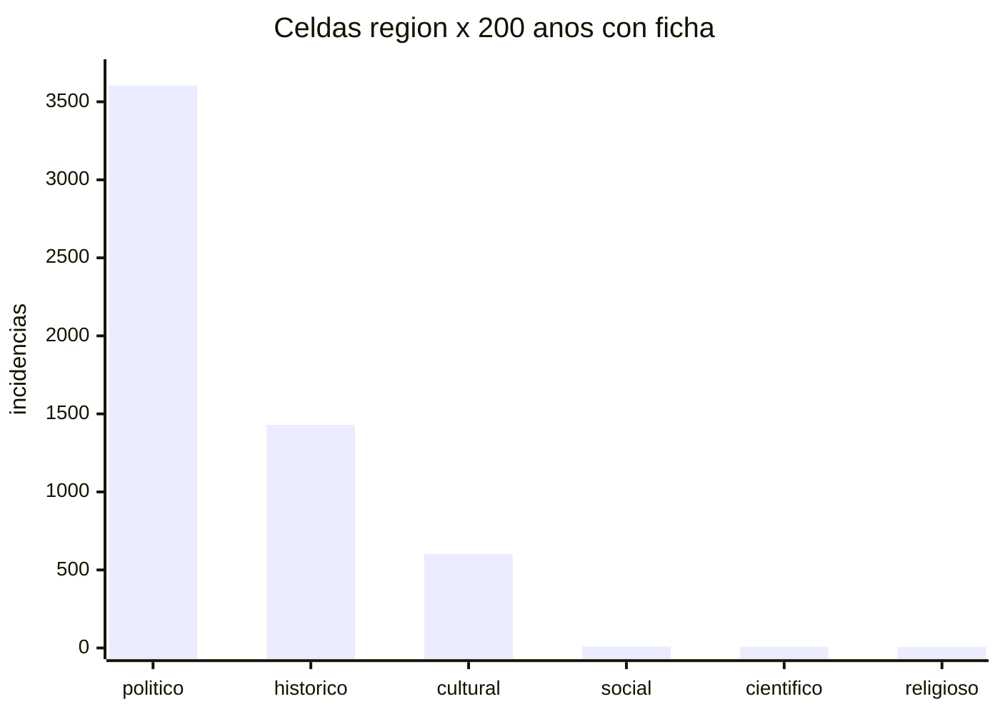

# Láminas (visibles en GitHub)

Los PNG canónicos viven en este directorio (`grafica_1_….png` … `04_….png`).
Si GitHub aún no los muestra, es porque el conector no escribe binarios.
Mientras tanto, estas reconstrucciones usan **los mismos números** de `graficas_1a7_meta.json`.

## Gráfica 3 — radio espectral de A_t

Ninguna ventana se sostiene sola. `A^n u` es escenario.

## Gráfica 5 — Allen (71 348 pares)

El solape gana. El relevo del día (`meets` / `met_by`) es raro.

## Gráfica 6 — masa_malla en t = 1000

Tinta, no importancia. Radio aún compartido entre lentes.

## Gráfica 7 — incidencias en la rejilla

Lo religioso y lo científico viven en la transversal, no en las 16 regiones.

## Archivos de figura

| Lámina | PNG |
|---|---|
| 1 Morse/Reeb | `grafica_1_morse_reeb.png` |
| 2 Persistencia | `grafica_2_persistencia.png` |
| 3 Espectro A_t | `grafica_3_espectro_At.png` |
| 4 Wasserstein | `grafica_4_wasserstein.png` |
| 5 Allen | `grafica_5_allen.png` |
| 6 Seis sábanas | `grafica_6_seis_sabanas.png` |
| 7 Fibrado RxTxD | `grafica_7_fibrado_rtd.png` |
| 8 Fibras | `01_fibras_heatmap.png` |
| 9 Correlación | `02_lentes_correlacion.png` |
| Vector (d_T,d_R,d_D) | `03_vector_distancia_y_normas.png` |
| Cono / collado | `04_cono_sabana_collado.png` |
