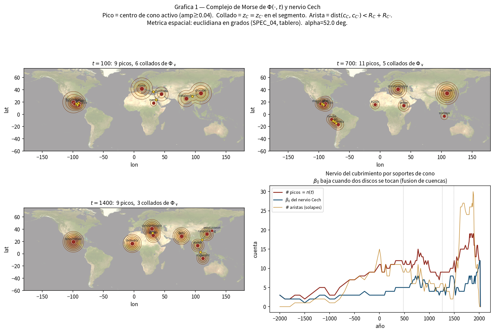
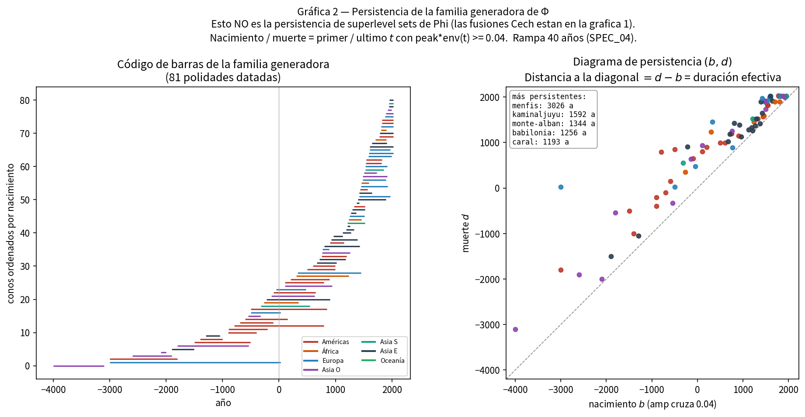
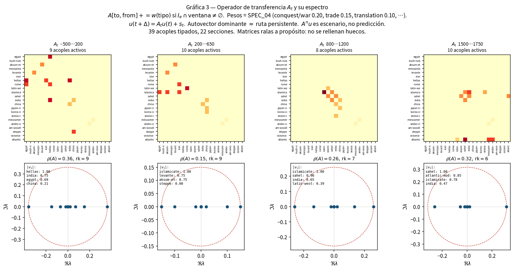
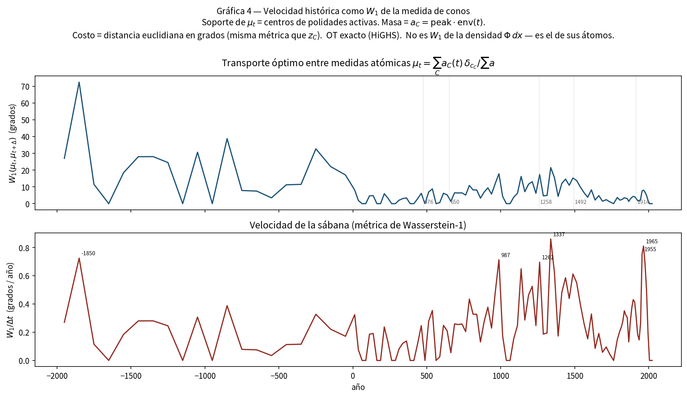
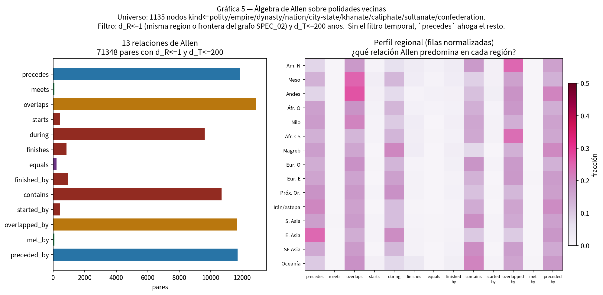
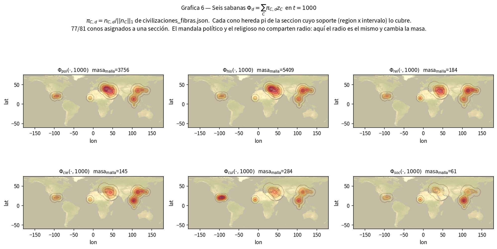
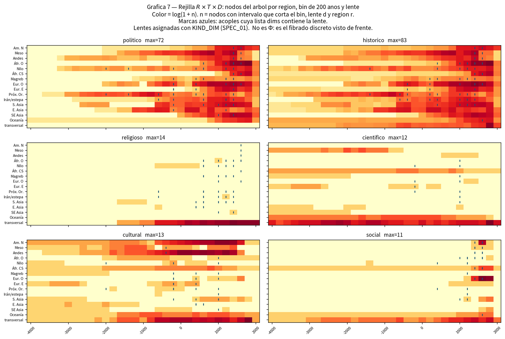
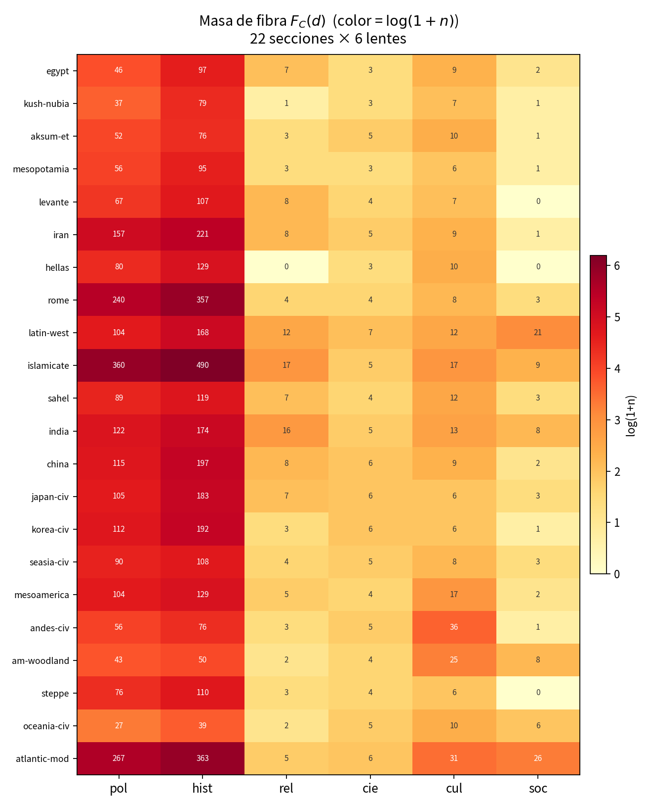
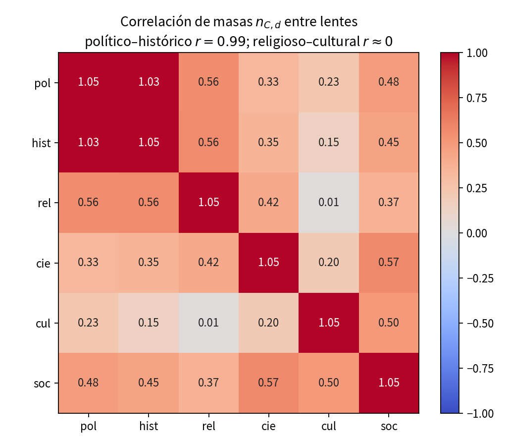

**MODELO MATEMÁTICO DE LA HUMANIDAD**

**El relieve de la historia**

*Civilizaciones, geografías, dependencias e intersecciones*

Ensayo largo de síntesis historiográfica. Segunda redacción, ampliada civilización por civilización, a partir del corpus v6.3–v7.2 y de siete cortes empíricos.

*31 de agosto de 2026 · documento de trabajo*

**Resumen**

Este ensayo lee un archivo mundial que no está organizado como crónica única. Reúne 2 296 nodos cronológicos, 2 522 fichas ontológicas, 22 secciones civilizatorias, 39 acoples tipados y 81 conos de polidades datadas, de Uruk, Menfis y Caral hasta 2026.[^1] La tesis es una sola: la historia humana no avanza por un tronco. En un mismo año conviven dinastías, ritos, técnicas y regímenes de trabajo que no se subsumen. Quien los aplasta en un índice de «complejidad» gana un gráfico y pierde el objeto.

La primera redacción de este texto ofrecía el argumento y las siete láminas. Esta segunda lo desarrolla como se desarrolla un handbook: cada sección civilizatoria tiene geografía, intervalo, fibras, conos encendidos, acoples de entrada y de salida, dependencias y huecos. El lector debe poder seguir el Nilo, el monzón, el Altiplano o el Sahel sin que el modelo le robe los nombres.

Las siete figuras no son adorno. Cada una responde a una pregunta de historiador. ¿Quién está vivo a la vez? ¿Cuánto dura un poder con fecha? ¿Por dónde viaja lo que viaja? ¿Cuándo se mueve el mapa? ¿Los vecinos se relevos o se montan? ¿El año mil pesa igual en lo sagrado y en lo fiscal? ¿Qué regiones encienden qué lentes y en qué siglos? El ensayo enseña a leerlas, una por una, y luego vuelve a ellas desde cada civilización.

**Palabras clave:** historia mundial; simultaneidad; civilización como sección; mandala; lentes; orígenes de la especie; acople; puerto; sesgo de archivo.

**Índice**

**I. El problema que un árbol no resuelve**

La forma más cómoda de contar la humanidad es un tronco con ramas. Egipto engendra a Roma, Roma al Occidente, el Occidente al mundo. Esa genealogía es pedagógicamente eficaz y empíricamente falsa. En el año 100 de nuestra era Teotihuacan levanta su cuenca en el Altiplano, Roma administra el Mediterráneo, Meroe sostiene el Nilo medio, Ctesifonte hereda el Irán, Pataliputra y Chang’an organizan otros dos mundos. Ninguna de esas polidades es hija de las otras. Son contemporáneas. Un árbol obliga a elegir una sola relación de inclusión. La historia no elige.

El archivo que aquí se interpreta nació para no elegir. Guarda el hecho una vez y lo corta por varias lecturas. Llamamos a esas lecturas lentes. La histórica pregunta qué ocurrió según fuente pública. La científica pregunta qué data el radiocarbono, el genoma o la filología. La religiosa pregunta qué afirma una comunidad sobre lo sagrado. La cultural pregunta qué formas —texto, rito, estilo, horizonte— se transmiten. La social pregunta quién organiza a quién. La política pregunta qué polidad sostiene el territorio. Un mismo viaje, el hajj de Mansa Musa en 1324–1325, es las cinco cosas a la vez: un rey altera precios en El Cairo, un pilar del islam se cumple, el oro redistribuye prestigio saheliano, el Atlas catalán lo pinta, y al-ʿUmarī se discute como cifra.

Tampoco se trata de disolver la política. El Estado, la dinastía y el imperio son objetos reales. Lo que se niega es que agoten el paisaje. Una civilización, en este ensayo, no es un nodo con nombre eterno. Es una franja de territorio y de siglos —una línea de mundo— más las fibras que en esa franja se pueden leer. Alejandría no «pertenece» a Egipto o a la Hélade o a Roma. Es un puerto: el punto donde esas secciones se tocan.[^2]

Braudel enseñó a mirar el Mediterráneo como duración, no como batalla.[^3] Wolters enseñó a mirar el sureste asiático como mandala: soberanías que se solapan, no particiones westfalianas. Hodgson enseñó a no llamar «islam» a todo lo que ocurre bajo dinastías musulmanas.[^4] Este archivo traduce esas tres modestias en reglas ejecutables. Un cono de influencia dura exactamente el intervalo de la polidad. Teotihuacan no está encendida en el año 700. Tenochtitlan no lo está en el año 100. Mesoamérica no es un imperio de dos mil años. Quien pinta eso no hace historia mundial: hace heráldica.

Hay una segunda modestia, igual de dura. No existe una distancia única que diga cuán cerca están dos hechos. Estar en el mismo siglo no es estar en el mismo valle. Compartir un rito no es compartir una frontera. El objeto es un triplete —tiempo, región, lente— y cualquier suma es una política de la mirada que debe declararse. El ensayo no corona ganadores.

**Qué es este archivo y qué no es**

El árbol se declara incompleto a propósito. No incluye cada señorío, cada mahajanapada menor ni cada aldea con nombre. El nivel de corte es el de un handbook regional: lo que la *Cambridge World History*, la *Historia General de África* de la UNESCO, el INAH o la escuela de Rowe y Lumbreras distinguen como unidad.[^5] Inventar brazos para «cubrir» Oceanía, el Magreb pre-cartaginés o el centro-sur africano sería una falta de oficio. Donde el taladro aún no llega, el mapa debe verse pálido.

Eso importa para cada figura. Cuando una lámina muestra pocas cimas en el año 100 y muchas después de 1500, parte de esa densidad es historia —hay más polidades documentadas, más capitales, más Estados que dejan archivo— y parte es el sesgo del propio corpus, taladrado con más detalle en siglos tardíos. Tratar el recuento de fichas como «auge de la humanidad» sería el error de especificación más grave que este proyecto puede cometer.

Debajo de las dinastías hay otra historia, más larga y de otro tipo. La divergencia del linaje humano, las radiaciones de Hominina, las salidas de África, la introgresión con arcaicos y el poblamiento de Sahul, Eurasia y las Américas no son conos de imperio. Son el soporte geográfico sobre el que después se sientan las civilizaciones. El modelo pan-africano de sapiens —fósiles en Jebel Irhoud hacia 300 000 años, no un único Edén oriental— y la idea de dos poblaciones africanas que se separan y se refundan son el piso operativo.

Las salidas de África no son una flecha. Hay industria en Asia hacia 2,1 millones de años cuya especie sigue abierta; hay erectus en Dmanisi y en Java; hay sapiens en el Levante mucho antes de 50 000 años cuyos linajes no son el tronco de los no africanos actuales; hay una dispersión hacia 60–50 000 que sí deja descendencia; hay mestizaje con neandertales y denisovanos en ventanas distintas.[^6][^7][^8][^9] El «origen de la historia», si esa frase tiene sentido, es la intersección de tres conjuntos: el soporte geográfico de nuestra especie, las rutas que sí dejaron nietos, y los paquetes culturales que llegan al Holoceno. Quien convierta un taxón en capital comete la falta que el contrato del proyecto declara inválida.

**Conversación con quien ya matematizó la historia**

La cliodinámica de Turchin y el banco Seshat midieron cientos de sociedades y encontraron que una sola dimensión principal organiza buena parte de la complejidad social.[^10] Eso no se ignora. Se traduce. Esa dimensión es una proyección de un vector más rico, no su reemplazo. Guardar seis componentes y calcular después, si se quiere, la suma, es lo contrario de fingir que lo religioso-émico no existe porque correlaciona con el fisco.

Korotayev mostró que la urbanización y la población mundiales admiten, hasta cierto régimen, una hipérbola de ajuste asombroso.[^11] Esa hipérbola no es la curva de un rito ni la de una sábana de influencia. Una singularidad en una fecha futura es un artefacto del régimen, no un destino. Morris construyó un índice de energía, organización, guerra e información y advirtió él mismo que el gráfico «no es correcto»: sirve para ver una forma a explicar.[^12] Taagepera midió el área de los imperios y halló saltos; el radio de nuestros conos es el primo geométrico de esa área, no su ley.[^13]

Popper sigue valiendo. No hay ley de la historia que declare al ganador.[^14] Quien quiera un ganador debe publicar la norma con la que lo eligió, y el horizonte: a diez años manda la coerción; a cien, el fisco y la demografía; a quinientos, la institución; a dos mil, la lengua, la escritura y el rito.

**Cómo se mira, sin jerga**

**Cortar el año.** Se pregunta qué polidades, ritos y textos están vivos en una fecha. El año 700 no contiene a Teotihuacan. El año 1400 sí contiene a Tenochtitlan, Constantinopla, El Cairo, Tombuctú, Delhi, Nankín, Angkor y Majapahit. Esa lista no es un ranking. Es una simultaneidad.

**Seguir una fibra.** En la franja de Egipto se puede leer lo político —las dinastías— y, aparte, lo religioso: maat, Osiris, el atonismo, la Iglesia copta. Mismo suelo, distinta fibra. Un nodo puede vivir en varias franjas: eso es un puerto, no un error de clasificación.

**Marcar el cruce.** Un acople es un cruce datado y tipado: conquista, tratado, comercio, traducción, diáspora, conversión, fusión, sucesión, guerra, coexistencia, contacto, expansión. Hay 39. Son pocos. Esa escasez es un dato: el archivo no pretende que todo influya sobre todo.

Sobre el mapa, cada polidad datada levanta un cono cuya altura resume cuántas de esas fibras están llenas y cuyo radio crece con la altura. Donde dos conos se montan, la sábana sube: ahí está el puerto. Donde uno se apaga, la curva de nivel se contrae hasta desaparecer. No es que la ciudad se borre del pasado. Es que deja de levantar el presente. Los pesos con los que un cruce empuja a otro —más la conquista que la coexistencia, más la sucesión que el simple contacto— no son datos arqueológicos. Están declarados como elección de escala. Se pueden cambiar. Lo que no se puede es inventar el cruce.

**II. Siete láminas, leídas en voz alta**

Antes de bajar a cada civilización hay que aprender a leer las siete figuras como se lee un mapa mural en un aula: qué pregunta hace, qué muestra, qué no muestra, y qué error de lectura está prohibido. Los números salen del corpus del 31 de agosto de 2026. No se redondean para que suenen épicos.

**Cómo se construyeron, en una página**

Las 22 secciones no son continentes. Son soportes: una lista de regiones del archivo más un intervalo. Egipto vive en el Nilo entre −4000 y 640. El campo islamicate vive en seis regiones a la vez, desde 622. El sistema atlántico moderno vive en seis regiones desde 1492. Un nodo entra en la fibra de una sección si su intervalo se solapa con ese soporte y su región está en la lista —o si es un eje religioso etiquetado para esa área. Por eso Assur puede caer en más de una sección según el siglo, y por eso Alejandría es puerto.

Los 81 conos no son las 22 secciones. Son polidades con capital y fechas. San Lorenzo (−1400 a −1000) no es Teotihuacan (−100 a 650). Teotihuacan no es Tula (900–1150). Tula no es Tenochtitlan (1325–1521). La regla del simulador lo dice en una línea: el origen del relieve está en −4000 con Uruk, Egipto y Caral; Mesoamérica se taladra como relevo, no como esencia.

Los 39 acoples son el esqueleto de las rutas. De 231 pares posibles entre 22 secciones, 34 están documentados. El mundo de este archivo no es una red completa. Es un grafo ralo, y esa rareza es lo que permite leerlo. Cada acople tiene tipo, intervalo, lentes y, casi siempre, un via: un acontecimiento que lo ancla (Qadesh, el hajj, Cajamarca, Malaca, 1258).

**Lámina 1. El relieve y sus collados**

*Figura 1. Relieve de influencias en los años 100, 700 y 1400, y evolución del número de cimas, de cruces entre discos y de cuencas separadas. Un punto dorado es un collado: dos conos se tocan.*

Se lee de izquierda a derecha y de arriba abajo. Arriba hay tres mapas del mismo relieve en tres fechas. Abajo, tres series: cuántas cimas hay, cuántos toques entre discos, cuántas manchas separadas. Una cima es una polidad que en ese año tiene masa suficiente para alzar la sábana. Un collado es el puerto geométrico: dos radios se tocan. Una cuenca separada es un mundo que, en ese corte, no se toca con los otros.

En el año 100 hay nueve cimas y seis collados. El Altiplano —Teotihuacan, El Mirador, Monte Albán— forma un sistema. El Mediterráneo–Próximo Oriente —Roma, Ctesifonte, Meroe— forma otro. Chang’an y Pataliputra sostienen Asia. África occidental y el norte europeo no levantan cono. Eso no es vacío histórico. Es vacío de este relieve: no hay polidad datada con la masa suficiente para alzar la sábana en esas coordenadas.

En el año 700 Teotihuacan se ha apagado. El Altiplano no desaparece: cambia de cimas. Tikal, y en los Andes Moche, Tiwanaku y Wari, sostienen el continente. Constantinopla, Aksum, Kumbi, Chang’an y Srivijaya componen un mundo viejo ya irreconocible respecto del año 100. Roma de Occidente no está. La regla del intervalo ha hecho su trabajo.

En el año 1400 el mapa cabe en una frase que ningún manual de «Edad Media» debería prohibir: Tenochtitlan, Constantinopla, El Cairo, Tombuctú, Delhi, Nankín, Angkor y Majapahit están vivos a la vez. El collado entre las cimas del sureste asiático dice, en lenguaje de relieve, lo que los acoples de difusión y conversión dicen en lenguaje de crónica: hay un mar interior de formas que no es un imperio.

La serie temporal cuenta otra historia. El número de cimas oscila entre pocas unidades durante milenios y se dispara después de 1500, cuando el mallado de conos modernos es más denso y los pasos de año son más finos. Las cuencas separadas no crecen al mismo ritmo: los discos empiezan a fundirse. El mundo se vuelve, en este relieve, menos archipiélago y más red. Parte de esa fusión es la primera globalización. Parte es que por fin fichamos capitales en todos los continentes a la vez.

Error prohibido: contar cimas como «progreso». El año 100 no es un mundo pobre. Es un mundo del que este relieve solo alza nueve capitales.

**Lámina 2. Cuánto dura un poder que tiene fecha**

*Figura 2. Duración efectiva de las 81 polidades que levantan cono. Nacimiento y muerte son el primer y el último año en que el cono tiene masa perceptible. La mediana ronda los cuatro siglos.*

A la izquierda, un código de barras: cada raya es una polidad, de su primer año perceptible a su último. A la derecha, cada punto es nacimiento contra muerte. La diagonal sería una polidad que nace y muere el mismo año; nadie vive ahí. Cuanto más abajo y más a la derecha, más larga la barra.

La mediana es de unos 394 años. Eso está en el orden de lo que un historiador espera de una formación estatal premoderna que deja capital y archivo, no de una «civilización milenaria». Los más persistentes de esta lista —Menfis, Kaminaljuyú, Monte Albán, Babilonia, Caral— delatan, además, un problema de corte. Menfis a tres mil años no es una polidad: es una ciudad usada como etiqueta demasiado ancha. Un paper honesto lo señala para que el próximo taladro parta esa barra en dinastías: Reino Antiguo, Medio, Nuevo, Saíta, Ptolemaica.

El código de barras, leído de izquierda a derecha, es una historia del relevo. Asia occidental y el Nilo abren. Las Américas entran con horizonte propio, no como apéndice. Europa y África al sur del Sáhara tienen barras más cortas y más tardías en este recorte de 81, porque 81 cimas no son el mundo: son las que el simulador eligió para levantar relieve. Caral (−3000 a −1800), Uruk (−4000 a −3100) y Mohenjo-Daro (−2600 a −1900) recuerdan que el Estado no nace en un solo valle.

Error prohibido: leer la barra de Menfis como «Egipto duró tres mil años y por eso ganó». El archivo no midió duración de una esencia. Midió un intervalo mal partido.

**Lámina 3. Las rutas que el archivo sí documenta**

*Figura 3. Cruce de secciones por ventanas de siglos. Cada celda es un acople tipado activo en esa ventana. El vector dominante nombra la ruta que el archivo sostiene, no la que un modelo desea.*

Abu-Lughod reconstruyó un sistema-mundo anterior a 1350 con circuitos que no pasaban por Lisboa.[^15] Esta lámina es más pobre y más honesta: solo pinta los 39 acoples fichados, cortados en cuatro ventanas. Cada celda oscura es un cruce activo. El vector que se imprime debajo nombra la combinación de secciones que, en esa ventana, más empuja.

Entre 500 antes de nuestra era y 200, la ruta que el archivo sostiene pasa por la Hélade, la India y Egipto: Alejandro, los indo-griegos, Alejandría, Roma tomando el Mediterráneo. Entre 200 y 650 el centro se corre hacia el mundo que va a llamarse islamicate, el Levante y Aksum: el siglo VII no empieza el islam en el vacío; lo hereda de un sistema ya acoplado. Entre 800 y 1200 la ruta es islamicate–Sahel–India: oro, canon, traducción, el hajj. Entre 1500 y 1750, Sahel, Atlántico e islamicate: trata, conquista de México y del Tahuantinsuyu, el Índico todavía lleno.

Ninguna de esas ventanas tiene un operador denso. El radio de transferencia es menor que uno: sin fuentes nuevas —un texto, una capital, una reforma—, el empujón se apaga. Eso, en lenguaje de historiador, es olvido institucional. Una corte que se quema no deja de haber existido. Deja de empujar el año siguiente.

Error prohibido: leer el vector de 1500–1750 como «Occidente gana la historia». El vector incluye al Sahel. El Índico no se ha apagado. Lisboa entra al esqueleto; no lo reemplaza.

**Lámina 4. Cuándo se mueve el mapa**

*Figura 4. Distancia entre el mapa de un año y el del siguiente, y esa distancia dividida por los años transcurridos. Los picos son siglos en los que las capitales activas cambian de lugar o de peso.*

La pregunta no es quién manda. Es cuán de prisa cambia el quién. Se toma el mapa de conos encendidos en un año, el mapa del año siguiente, y se mide cuánta masa hay que mover para pasar de uno a otro. Arriba, esa distancia. Abajo, la misma distancia dividida por los años del paso —porque el mallado no es uniforme: a veces el simulador salta un siglo, a veces diez años.

Los picos caen hacia 1337, hacia 1262, hacia 987, y otra vez hacia 1955–1965. Los de los siglos XIII y XIV coinciden con lo que la crónica ya nombra: el relevo en el Altiplano, Delhi, el golpe de 1258 sobre Bagdad, el Yuan. El de finales del siglo X encaja con un mundo de capitales que se reordenan —Song, el Califato que ya no es Damasco, el pulso tolteca—. Los de 1950 son, en parte, recambio real de capitales modernas y, en parte, un artefacto: el mallado se vuelve de a diez y el relieve se vuelve más nervioso.

El pico hacia 1850 antes de nuestra era, con pocas cimas encendidas, debe leerse con desconfianza. Cuando solo hay dos o tres capitales en el mapa, nacer una en otro continente mueve mucha masa. No es el siglo más dramático de la humanidad. Es el siglo en el que este relieve todavía es pobre.

Error prohibido: traducir «velocidad alta» por «progreso» o por «catástrofe». Es recambio de capitales en el archivo. Una peste que no mueve capitales no aparece. Una corte que se muda cien kilómetros sí.

**Lámina 5. Cómo se suceden los vecinos**

*Figura 5. Cómo se relacionan en el tiempo 71 348 pares de polidades vecinas que no distan más de dos siglos. La moda no es el relevo limpio: es el solape.*

James Allen enumeró trece maneras en que dos intervalos pueden mirarse: uno precede al otro, lo contiene, lo monta, lo encuentra en el día exacto, coincide con él.[^16] Aplicadas a 1 135 polidades vecinas —filtro de región y de no más de dos siglos de separación—, el resultado es inequívoco. Lo más frecuente es que dos poderes se monten. El relevo limpio, un año de por medio, es rarísimo: unas 140 parejas entre más de setenta mil.

Los Andes y Mesoamérica solapan más. Eso encaja con horizontes arqueológicos que se montan —Formativo, Clásico, horizontes andinos— mejor que con una lista de reyes que se pasan el cetro. Asia oriental, en este recuento, precede más: la sucesión dinástica china, tal como el handbook la ficha, es más lineal. América del Norte aparece con un perfil de «ser solapada»: formaciones que viven dentro del intervalo de otras. Oceanía, otra vez, se ve pálida.

Hay 205 pares fichados como iguales y apenas 64 que se encuentran en el día. El archivo casi no corta las dinastías en el día exacto. La historia tampoco. 476, 1453, 1521 son excepciones que el relato recuerda precisamente porque son raros.

Error prohibido: concluir que «en China hay orden y en Mesoamérica caos». Hay dos tradiciones de fichar. Una prefiere la lista de dinastías. La otra prefiere el horizonte. El solape mide esas tradiciones tanto como mide el pasado.

**Lámina 6. Seis sábanas en el año mil**

*Figura 6. El mismo año mil, cortado por las seis lentes. La forma se parece porque, hoy, todas comparten el radio del cono político. Cambia la masa. Esa semejanza es un límite del dibujo, no una tesis sobre el mundo.*

Seis mapas del mismo año. Lo político y lo histórico pesan de más: es el handbook. Lo cultural tiene masa visible en Mesoamérica. Lo religioso se ve en el mundo islamicate y en Asia. Lo social es casi un susurro. Lo científico, otro. Un historiador del año mil no se sorprende. Song, el mundo chola, el pulso tolteca, los horizontes andinos tardíos y las cortes del islam no son simétricos en el archivo que hemos heredado.

Hay que decir lo que la figura no logra. El mandala político de una corte y el mandala de un canon no tienen el mismo radio. Wolters lo sabía de Ayutthaya y del theravāda. Aquí, por construcción, el radio es el mismo y solo cambia el peso. La lámina mide, por tanto, un vacío del modelo tanto como un hecho del siglo. El próximo dibujo honesto es un radio por lente.

En números de masa sobre la malla, lo histórico pesa más que lo político, lo cultural más que lo religioso, y lo social y lo científico quedan por debajo. Esas magnitudes no son «importancia». Son tinta.

Error prohibido: decir que «en el año mil todas las dimensiones coinciden». Coinciden los radios del lápiz.

**Lámina 7. La rejilla del tiempo largo**

*Figura 7. Región, bin de dos siglos y lente. La fila inferior —transversal— guarda lo que no se clava a un territorio. Las marcas azules son acoples cuya lente coincide con el panel.*

Dieciséis regiones más una fila transversal. Bines de doscientos años, de −4000 a 2000. Seis paneles, una lente cada uno. El color sigue la cantidad de fichas. Las cruces azules marcan un acople activo cuya lente es la del panel.

Leída de izquierda a derecha, cada lámina se oscurece hacia el presente. Eso no es el auge de la humanidad. Es el auge del papel, de la epigrafía tardía, del colonialismo que ficha y del propio taladro del proyecto. El Nilo y el Próximo Oriente encienden pronto lo político. Mesoamérica y los Andes encienden lo cultural mucho antes de encender un Estado con la densura de un handbook europeo. Lo religioso y lo científico viven, sobre todo, en la fila que no tiene patria. Los dioses y los huesos no respetan las dieciséis regiones del archivo.

Lo social se enciende tarde en Europa occidental y en América del Norte. El historiador del trabajo y de la diáspora tiene derecho a protestar: el Sahel y el Índico ya eran sociales. El archivo, en esta rejilla, los deja más pálidos de lo que los acoples —comercio saheliano, diáspora, trata— ya documentan. Cuando la figura y la lista de cruces no dicen lo mismo, se prefiere el cruce tipado a la celda pálida. El hajj está fichado. La celda social del Sahel en el siglo XIV no debe contradecirlo; debe ponerse al día.

Error prohibido: leer la fila transversal como «resto del mundo». Es la fila de lo que el territorio no alcanza a poseer.

**Dos figuras de apoyo: dónde está la tinta**

*Figura 8. Masa de archivo por sección civilizatoria y lente. Escala logarítmica. Fuente: civilizaciones_fibras.json, 22 secciones.*

*Figura 9. Correlación de las masas de archivo entre lentes, a través de las 22 secciones.*

La figura 8 enseña de un vistazo lo que cada ensayo regional va a repetir con nombres. La banda izquierda —política e histórica— es casi toda la tinta. Islamicate, Roma y el Atlántico moderno concentran fichas porque el corpus se taladró ahí con más densura, y porque esas secciones cubren muchos siglos y muchos territorios. Oceanía, el woodland norteamericano y Kush aparecen más pálidos. Eso no autoriza a decir que hubo menos historia. Autoriza a decir que este archivo, hoy, las conoce peor.

Hay excepciones que importan. Los Andes tienen una fibra cultural desproporcionada respecto de su fibra política: 36 contra 56. El woodland también carga cultura (25) frente a una política más delgada. El Occidente latino muestra la fibra social más visible de las secciones preatlánticas (21). La Hélade, en este recuento, tiene cero fichas religiosas clavadas a la sección: no porque Grecia no tuviera dioses, sino porque esas fichas viven en el árbol religioso transversal.

La figura 9 es el hallazgo que un historiador puede traducir sin traicionarlo. Lo político y lo histórico correlacionan cerca de 0,99. Una sola dimensión principal explica cerca del 99 por ciento de la varianza de esas masas, y está hecha de política más archivo. Quien colapse las seis lentes a ese componente no descubre la complejidad: reproduce el sesgo del handbook. Lo decisivo está en el residual. Lo religioso y lo cultural correlacionan cerca de cero. Un canon y un estilo no son la misma fibra. India carga religión; los Andes cargan cultura. Esa ortogonalidad es el argumento más limpio contra el índice único.

**III. Las veintidós secciones de un vistazo**

Antes de los ensayos, la tabla. El intervalo es el soporte de la sección, no la suma de sus conos. El recuento es masa de archivo, no poder. Las regiones son las del fibrado, no las de un atlas escolar.

|  |  |  |  |  |
|----|----|----|----|----|
| **Sección** | **Intervalo** | **Regiones** | **Fichas** | **Lo que el archivo acentúa** |
| Egipto nilótico | −4000 / 640 | Nilo | 115 | Dinastías; fibra religiosa que no muere en 30 a.C. |
| Kerma–Kush–Meroe | −2500 / 350 | Nilo | 88 | La otra orilla del mismo río |
| Aksum / Etiopía | −400 / 1974 | Nilo | 91 | Mar Rojo; continuidad larga |
| Mesopotamia | −3500 / −539 | Próximo Oriente | 105 | Se apaga cuando entra en Irán |
| Levante | −3000 / 640 | Próximo Oriente | 121 | Pasillo de casi todos los acoples antiguos |
| Iranias | −700 / 2026 | Irán-estepa + PO | 239 | De Persépolis a Isfahán |
| Mundo griego | −1600 / 30 | E. oriente/occ. + PO | 140 | Cero fibra religiosa en la sección |
| Roma | −753 / 1453 | EU, PO, Magreb | 370 | Dos cortes: 476 y 1453 |
| Occidente latino | 476 / 2026 | Europa occ. | 192 | Fibra social más visible |
| Campo islamicate | 622 / 2026 | Seis regiones | 520 | Campo, no Estado |
| Sahel occidental | −2000 / 1900 | África occ. | 138 | Oro, hajj, trata |
| Campo índico | −2600 / 2026 | Asia meridional | 203 | Traducción y monzón |
| Campo sínico | −1600 / 2026 | Asia or. | 215 | Dinastías + difusión al este |
| Japón | −300 / 2026 | Asia or. | 199 | Recibe; no irradia en este esqueleto |
| Corea | −700 / 2026 | Asia or. | 203 | Igual: acople de entrada |
| Mandala SE asiático | −500 / 2026 | SE Asia | 122 | Angkor, Srivijaya, Malaca |
| Mesoamérica | −2000 / 1697 | Meso | 149 | Relays, no esencia |
| Andes centrales | −3000 / 1572 | Andes | 117 | Fibra cultural desproporcionada |
| Bosques orientales NA | −1000 / 1700 | Am. Norte | 78 | Taladro abierto |
| Estepa euroasiática | −900 / 1758 | Irán-estepa | 120 | Xiongnu, Yuan, Horda |
| Sahul / Lapita / Polinesia | −65000 / 2026 | Oceanía | 56 | La más pálida; no se rellena |
| Sistema atlántico moderno | 1492 / 1888 | Seis regiones | 404 | Haz colonial, no civilización única |

*Tabla 1. Las 22 secciones del fibrado. Fuente: civilizaciones_fibras.json v7.1.0.*

**IV. Ensayos por civilización**

Cada ensayo sigue el mismo orden, a propósito. Primero el suelo. Después el intervalo y lo que el archivo ficha. Después los conos que alzan relieve. Después los acoples —de quién depende, a quién empuja, con quién se monta—. Al final, lo que falta. El lector puede saltar. El orden no es un ranking.

**IV.1. Egipto nilótico**

*Soporte −4000 a 640 · región af-nile · 115 fichas · 46 políticas, 97 históricas, 7 religiosas, 3 científicas, 9 culturales, 2 sociales.*

El Nilo no es un decorado. Es una máquina de crecida, de transporte y de frontera. El desierto cierra por el oeste y por el este; las cataratas cierran por el sur; el Delta abre al Levante. Quien controla la crecida controla el grano; quien controla el grano controla la corte. Por eso el archivo empieza aquí tan pronto: Naqada, las dos primeras dinastías, el Reino Antiguo. El cono que el simulador enciende, sin embargo, es demasiado ancho. Menfis de −3000 a 30 no es una polidad. Es una etiqueta que traga tres milenios. El historiador debe leer esa barra como un aviso, no como un hallazgo.

La sección se apaga en 640, con la conquista islámica de 639–642. Ese corte es político. La nota del propio archivo lo dice: la fibra religiosa no muere en 30 a.C., cuando Roma se anexa el reino ptolemaico. Maat, Osiris, el atonismo, los templos de época romana y, más tarde, la Iglesia copta no caben en la fecha de Actium. Quien enseñe que «Egipto acaba en Cleopatra» está leyendo solo la lente política.

Los acoples de Egipto son una lección de tipos. Con Mesopotamia, intercambio por Biblos entre −2500 y −1200: cedro, oro, prestigio, no anexión. Con el Levante, la guerra de Qadesh (−1274 a −1259) y, el mismo año de −1259, el tratado. Guerra y tratado no se funden: el archivo los ficha aparte, porque no son la misma operación. Con la Hélade, fusión en Alejandría (−280 a −30): la biblioteca no es una conquista. Con Roma, conquista en −30. Con el campo islamicate, conquista otra vez, 639–642, ahora también en la lente religiosa.

Geografía de la dependencia. Egipto no puede vivir sin el Levante si quiere madera y cobre; no puede vivir sin Nubia si quiere oro y, a ratos, reyes. Kerma y Kush no son un apéndice: son la otra orilla de la misma máquina fluvial, y el archivo les da sección propia precisamente para no tragarlas. Aksum, más tarde, mirará al mismo Nilo desde el mar Rojo.

Lo que falta. El Predinástico está fichado con menos densura que el Imperio Nuevo. El Egipto copto y el Egipto fatimí no viven en esta sección: el primero queda a medio camino, el segundo pasa al campo islamicate. El cono moderno de El Cairo (1805–2026) ya no es «Egipto nilótico». Es otra franja.

**IV.2. Kerma–Kush–Meroe**

*Soporte −2500 a 350 · Nilo · 88 fichas · fibra religiosa casi vacía en la sección (1).*

De la tercera catarata hacia el sur el Nilo cambia de acento. Kerma no es una provincia de Menfis. Es una corte con su propia Deffufa, su propio comercio y, en ciertos siglos, la capacidad de imponer reyes en Tebas. El archivo reúne Kerma, Kush, Jebel Barkal, Meroe y, más tarde, las Nubias cristianas —Nobatia, Makuria, Alodia— bajo una sección que se cierra en 350. Ese cierre es el del cono meroítico (−270 a 350). Las Nubias cristianas quedan, en la práctica, a caballo con Aksum y con el Egipto tardío.

La dependencia es simétrica y a menudo violenta. Kush necesita el norte como mercado y como prestigio; Egipto necesita el sur como oro y como frontera. La Dinastía XXV kushita en Tebas es el momento en que la sección «otra orilla» se sienta en el trono de la primera. El archivo no ficha ese siglo como acople aparte: lo guarda en las fibras políticas de ambas secciones. Es un hueco del esqueleto de 39, no un hueco de la historia.

Meroe, el cono visible, mira ya más hacia el mar Rojo que hacia Menfis. Cuando se apaga, el relieve del Nilo medio no desaparece: cambia de lengua y de culto. El historiador no debe leer 350 como el fin de Nubia. Debe leerlo como el fin de este cono.

Lo que falta. Una sola ficha religiosa en la sección es inaceptable como retrato de Jebel Barkal. Los dioses kushitas viven, otra vez, en el árbol transversal. Hay que clavarlo.

**IV.3. Aksum / Etiopía**

*Soporte −400 a 1974 · Nilo · 91 fichas · conos Aksum 100–940 y Addis Abeba 1889–2026.*

Aksum no es un Egipto menor. Es un Estado del mar Rojo que habla con el Levante por Adulis entre 100 y 700, pelea en Ḥimyar entre 518 y 570, y se convierte al cristianismo en un siglo en el que Constantinopla todavía es contemporánea. El soporte de la sección llega hasta 1974: el archivo eligió leer una continuidad larga —aksumita, zagwe, salomónida, imperio moderno— en lugar de partirla en esencias distintas. Esa es una decisión historiográfica, no una evidencia de que «Etiopía sea la misma» durante dos milenios.

Los acoples son dos, y bastan para situarla. Comercio con el Levante: marfil, oro, esclavos, vino, prestigio. Guerra con el mundo que será islámico, antes de que ese mundo tenga nombre de campo: la campaña de Ḥimyar. Cuando el islamicate se constituye, Aksum no entra como provincia. Queda al lado, cristiana, en las tierras altas. El cono de Addis Abeba (1889–2026) es el relevo moderno de esa excepción.

Geografía. Las tierras altas cierran. El mar abre. Quien enseñe el cuerno solo como interior africano pierde Adulis. Quien lo enseñe solo como Índico pierde el Nilo. La sección está bien clavada en af-nile, pero su acople verdadero es el agua.

**IV.4. Mesopotamia**

*Soporte −3500 a −539 · Próximo Oriente · 105 fichas · conos Uruk −4000/−3100, Ur −2100/−2000, Babilonia −1800/−539.*

El aluvión del Tigris y del Éufrates no produce un Estado eterno. Produce una serie de cortes que el archivo se niega a fundir. Uruk abre el relieve mundial: −4000 a −3100. Ur III dura un siglo justo. Babilonia, de −1800 a −539, es el cono más largo de la sección y también el más peligroso: otra etiqueta ancha. Hammurabi, casitas, asirios, caldeos no son la misma polidad. El próximo taladro debe partirlos.

La sección se apaga en −539 porque el archivo toma una decisión clara: cuando Ciro entra, Mesopotamia deja de ser soporte propio y pasa a la sección irania. No es que Babilonia deje de existir como ciudad. Es que deja de levantar una civilización autonoma en este fibrado. El acople es de conquista, lente política, un solo año. El cilindro de Ciro, el mismo año, se ficha además como acople Levante–Irán en lentes histórica y religiosa. Dos lecturas de la misma fecha, dos aristas.

La dependencia de Mesopotamia es la de un valle sin piedra y sin madera. Biblos, el Levante, el Zagros, el golfo. El acople con Egipto por intercambio (−2500 a −1200) es la versión larga de esa necesidad. Qadesh, más tarde, se pelea al oeste, no aquí; pero el sistema es el mismo pasillo.

Lo que falta. Asiria imperial no tiene cono propio en los 81. Nínive se lee hoy como nodo, no como cima del relieve. Es un hueco visible.

**IV.5. Levante**

*Soporte −3000 a 640 · Próximo Oriente · 121 fichas · el pasillo.*

Si una sección mereciera el nombre de puerto permanente, sería esta. No porque sea la más poderosa —no lo es—, sino porque casi todos los acoples antiguos la cruzan. Qadesh se pelea aquí y se firma aquí. Ciro pasa por aquí. Adulis comercia con aquí. Roma la administra. El islamicate la hereda en 640, y la sección se cierra.

Geografía. Una franja estrecha entre mar y desierto, con un interior de ciudades-Estado y un litoral que vive de otros valles. Ebla, Ugarit, Tiro, Jerusalén, Damasco, Antioquía no son un imperio. Son un sistema de escalas. El archivo las ficha con densura política (67) e histórica (107) y casi sin fibra social (0). Esa cero es un defecto: el Levante es, precisamente, sociedad de tránsito.

Cuando la sección se apaga, el suelo no se apaga. Pasa al campo islamicate y, en parte, a Roma de Oriente hasta 1453. El historiador que busque Damasco omeya o Jerusalén cruzada no las encontrará bajo «Levante». Las encontrará bajo otras franjas. Esa es la disciplina del soporte.

**IV.6. Iranias**

*Soporte −700 a 2026 · Irán-estepa y Próximo Oriente · 239 fichas · conos Persépolis −550/−330, Ctesifonte −141/637, Isfahán 1501–1736.*

Irán, en este archivo, no es una etnia. Es una sección larga que empieza cuando el handbook reconoce un campo iranio identificable (−700) y no se cierra. Aqueménidas, partos, sasánidas, dinastías islámicas, safavíes: la fibra política es la más poblada después del islamicate y de Roma (157). El riesgo es el de toda sección larga: parecer una esencia. Los conos impiden esa lectura. Persépolis se apaga en −330. Ctesifonte vive −141 a 637. Isfahán safaví es otra cima, 1501–1736. Entre medias hay siglos que el relieve no alza con capital propia.

Los acoples cuentan una biografía de choques. Recibe Mesopotamia y el Levante en −539. Choca con la Hélade en Gaugamela (−331). Choca con Roma en Edesa (260). Cae, como campo sasánida, en Qādisiyya–651, y esa caída es conquista política y religiosa hacia el islamicate. No por ello la sección muere: el soporte sigue hasta 2026. Lo que muere es un cono.

La estepa no es Irán, y el archivo se lo toma en serio: hay sección aparte. Pero el suelo se toca. Los partos vienen de ese contacto. Los mongoles, más tarde, conquistarán Bagdad sin pasar por esta arista irania. El esqueleto de 39 no ficha un acople Irán–estepa. Otro hueco.

**IV.7. Mundo griego**

*Soporte −1600 a 30 · Europa oriental, occidental y Próximo Oriente · 140 fichas · cono Atenas −500/30 · fibra religiosa de sección: 0.*

La sección empieza en el Egeo palaciego (−1600) y se cierra en −30, cuando el último reino helenístico relevante —el Egipto ptolemaico— pasa a Roma. Ese cierre es político. La fibra cultural no se acaba: el archivo la deja viajar dentro de Roma, de la India indo-griega y de Alejandría. Quien busque Bizancio bajo «Hélade» no la encontrará. La encontrará bajo Roma de Oriente.

Atenas (−500 a 30) es el único cono que el relieve alza con este nombre. Eso es una pobreza del simulador, no de la historia. Esparta, Tebas, Pérgamo, Siracusa, Alejandría merecerían cimas. El archivo las tiene como nodos; el relieve no las enciende. Hay que decirlo.

Los acoples son tres y todos de peso. Recibe la guerra de Gaugamela. Entrega a Roma la conquista del −146 al −30. Se funde con la India en el reino indo-griego (−180 a −10) y con Egipto en Alejandría (−280 a −30). Esas dos fusiones son el argumento más limpio contra la idea de una Grecia «europea» encerrada en el Egeo. El mundo griego de este archivo es un campo de koiné que llega al Hindu Kush y al Nilo.

El cero religioso es un defecto de indexación. Zeus no es una ausencia. Es una ficha que vive en el árbol transversal y no se clavó a la sección. El ensayo lo declara para que nadie escriba que «los griegos eran laicos».

**IV.8. Roma**

*Soporte −753 a 1453 · Europa occidental y oriental, Próximo Oriente, Magreb · 370 fichas · conos Roma −50/476 y Constantinopla 330–1453.*

Roma es la sección más densa después del islamicate y del Atlántico moderno. Cubre cuatro regiones. Tiene dos muertes políticas y ninguna muerte cultural en la nota del archivo: 476 no acaba la fibra; 1453 acaba el cono de Oriente. Quien enseñe «la caída de Roma» como un solo acontecimiento está eligiendo Occidente y olvidando que Constantinopla está encendida en el año 700 y en el 1400.

Los conos lo dicen mejor que el párrafo. Roma-ciudad, −50 a 476. Constantinopla, 330 a 1453. Hay un siglo de solape, 330–476, en el que las dos cimas están vivas. Ese solape es el Imperio que ya tiene dos cabezas. Después, solo una.

Acoples. Recibe Egipto en −30 y la Hélade entre −146 y −30. Choca con Irán en 260. Entrega Occidente al latino en 476 por sucesión —no por conquista: el archivo distingue el tipo—. Choca con el islamicate en 1453, guerra y relevo de cúpulas. El Magreb entra en la sección mientras Roma lo administra y sale cuando el islamicate lo hereda; no hay acople Roma–Magreb aparte, porque el Magreb no es sección. Es región.

Dependencia. El trigo de África, el oro de Iberia, las legiones del limes, la koiné griega en Oriente. Roma no es un valle. Es un mar con caminos. Braudel, leído al revés: el Mediterráneo sostiene a Roma tanto como Roma nombra al Mediterráneo.

**IV.9. Occidente latino**

*Soporte 476 a 2026 · Europa occidental · 192 fichas · conos Aquisgrán 768–888, y luego el relevo atlántico.*

Nace por sucesión, no por milagro. El acople de 476 es político y cultural: una corte deja de alzar el cono de Roma-ciudad y otra franja empieza a contar. Aquisgrán (768–888) es la primera cima propia. Después el relieve de esta sección se vuelve pálido durante siglos —no porque no haya reyes, sino porque el simulador no les encendió cono— hasta que Lisboa (1415–1975), Madrid (1479–1898), París (1589–2026), Londres (1583–1997), Ámsterdam (1602–1975), Viena (1526–1918) y Berlín (1871–2026) saturan el mapa. Esa saturación tardía es, otra vez, archivo y elección de cimas.

Los acoples que importan son cuatro. Sucesión desde Roma. Guerra con el islamicate, 1096–1291: las cruzadas, lente religiosa e histórica. Traducción con el mismo islamicate, 1126–1250, vía Ibn Rušd: lentes científica y cultural. El mismo siglo XII hace las dos cosas. Expansión hacia el sistema atlántico, 1492–1800. Quien reduzca el Occidente latino a las cruzadas pierde Toledo. Quien lo reduzca a Toledo pierde Jerusalén.

La fibra social (21) es la más alta de las secciones que no son el Atlántico moderno. Aquí viven, en este corpus, formas de trabajo, órdenes, universidades, y el preludio de la diáspora atlántica. No es que el Occidente «invente lo social». Es que este archivo lo ficha aquí con densura.

**IV.10. Campo islamicate**

*Soporte 622 a 2026 · seis regiones · 520 fichas · la sección más poblada · no es un Estado.*

Hodgson inventó la palabra para que no tuviéramos que decir «islam» cada vez que un sultán acuñaba moneda.[^17] El archivo la toma al pie de la letra. El campo cubre Próximo Oriente, Magreb, Irán-estepa, Asia meridional, África occidental y el Nilo. Tiene 360 fichas políticas y 490 históricas. No es una dinastía. Es el suelo compartido de muchas.

Los conos internos lo confirman. Bagdad abasí, 762–1258. El Cairo mameluco, 1250–1517. Estambul otomana, 1453–1922. Isfahán está en la sección irania; Delhi y Agra, en la índica. El campo no exige que cada capital sea «suya». Exige que el acople se pueda nombrar.

Recibe. Egipto en 639–642. Irán en 636–651. Roma de Oriente en 1453. La India en una ventana larga, 1206–1526, que no borra la fibra índica. El sureste asiático por conversión en Malaca, 1400–1511. El Sahel por comercio, 900–1600, y por el hajj de 1324–1325. Da guerra al Occidente latino y, el mismo siglo, le da traducción. Un campo que solo conquista, en este esqueleto, no existiría: también traduce, también comercia, también recibe a Mansa Musa.

1258 es el año que la lámina 4 registra como sacudida. El acople estepa → islamicate, vía Bagdad, es de conquista, un solo año, lentes histórica y política. El campo no se acaba. Se mueve: El Cairo, después Estambul. Quien enseñe que «los mongoles acaban el islam» está leyendo un cono como si fuera una civilización.

El riesgo de esta sección es el de su éxito. 520 fichas pueden tragar al Sahel, a la India y a Al-Ándalus como provincias de una esencia. Los acoples están puestos para impedirlo. Cada uno tiene tipo e intervalo. Mali no es una provincia abasí. Delhi no borra Varanasi.

**IV.11. Sahel occidental**

*Soporte −2000 a 1900 · África occidental · 138 fichas · conos Kumbi 300–1240, Tombuctú 1235–1460, Gao 1460–1591, Asante 1701–1901, Sokoto 1804–1903.*

El Sahel no empieza en el tráfico atlántico. Empieza, en este archivo, dos mil años antes de nuestra era, como franja de sábana y de comercio entre desierto y bosque. Los conos visibles son más tardíos y más honestos que el soporte: Wagadu/Ghana en Kumbi, 300–1240; Mali en Tombuctú, 1235–1460; Songhai en Gao, 1460–1591. El solape Kumbi–Tombuctú, 1235–1240, es el relevo que las crónicas de al-Bakrī y de Ibn Jaldūn enseñan a ver. Asante y Sokoto son ya el Sahel que conoce el Atlántico.

Los acoples son la biografía de una encrucijada. Con el islamicate, comercio por Awdaghust, 900–1600, lentes social y política: oro, sal, prestigio, caballos. Con el mismo campo, conversión-hajj en 1324–1325, lentes religiosa, social e histórica. Con la India, comercio por la costa suajili, 800–1500, lente social: el monzón no termina en Sofala; termina, para este archivo, en un Sahel que mira al Índico tanto como al desierto. Con el Atlántico moderno, trata 1501–1867 y diáspora 1600–1900 vía Candomblé. Esas dos aristas tardías no deben tapar a las tres primeras.

Geografía. El desierto no es un muro. Es un mar seco con puertos: Awdaghust, Sijilmasa, Tombuctú. El río Níger hace de Nilo occidental. Quien pinte el Sahel como interior aislado no ha leído ni el acople ni la crecida.

Lo que falta. El taladro no ha bajado con la misma densura a los señoríos que no dejaron crónica árabe. El archivo lo sabe. No se inventan.

**IV.12. Campo índico**

*Soporte −2600 a 2026 · Asia meridional · 203 fichas · 16 religiosas (la más alta junto al islamicate) · conos Mohenjo-Daro −2600/−1900, Pataliputra −321/550, Delhi 1206–1526, Agra 1526–1857, Delhi moderna 1947–2026.*

La sección empieza con la llanura del Indo y no se cierra. Mohenjo-Daro es contemporáneo de Ur y de Caral: el Estado urbano no es un milagro mesopotámico. Pataliputra (−321 a 550) cubre Maurya y Gupta con otra etiqueta demasiado ancha. Delhi sultanato (1206–1526) y Agra mogol (1526–1857) son ya el relevo que el acople con el islamicate nombra. Delhi 1947–2026 es el Estado-nación. Cinco cimas, cinco regímenes. No hay «India eterna» que las unifique.

La fibra religiosa (16) es, con la del islamicate (17), la más poblada de las 22. Veda, śramaṇa, budismo, jainismo, bhakti, islam del subcontinente: el archivo las guarda como familias, no como un «hinduismo» eterno. Esa densura explica el acople más largo del esqueleto: traducción hacia China, 65 a 800, vía el budismo chino. No es un ejército. Es un canon que viaja.

Hacia el sureste, difusión 802–1431 vía Angkor: religión, cultura y política. El mandala khmer y el javanés no son colonias. Son el radio de un modelo de realeza y de un sánscrito de corte. Hacia el Sahel, comercio suajili 800–1500. Hacia el islamicate, conquista 1206–1526: la ventana del sultanato. Conquista no es borrado. La fibra índica sigue fichada hasta 2026.

El acople con la Hélade, la fusión indo-griega (−180 a −10), impide además la fábula de un subcontinente sellado. Había koiné en Taxila. El archivo la nombra.

**IV.13. Campo sínico**

*Soporte −1600 a 2026 · Asia oriental · 215 fichas · la sucesión de capitales más larga del relieve.*

Erlitou (−1900 a −1500) y Anyang/Shang (−1300 a −1046) abren. El soporte de la sección, sin embargo, está declarado desde −1600: el archivo no da a Erlitou el estatuto pleno de campo sínico, y esa cautela es correcta. Chang’an (−221 a 907) cubre Qin, Han y Tang con otra etiqueta ancha. Después el relieve se vuelve honesto porque parte: Kaifeng 960–1127, Hangzhou 1127–1279, Dadu Yuan 1271–1368, Nankín Ming 1368–1421, Beijing Ming 1421–1644, Beijing Qing 1644–1912, Beijing RPC 1949–2026. Quien recorra esa lista ya ha leído milenios de historia china sin necesidad de una esencia.

Acoples de salida: difusión del budismo a Corea (300–700) y a Japón (538–800). Acople de conflicto con la estepa: guerra xiongnu −200 a 100, conquista yuan 1271–1368. Acople de entrada: traducción desde la India, 65–800. China, en este esqueleto, recibe un canon y entrega un canon. También recibe jinetes. El archivo distingue al monje del jinete, y el historiador debe distinguirlos.

La lámina 5 dice que Asia oriental «precede» más que solapa. Es el efecto de fichar por dinastía. El historiador de los Reinos Combatientes o de las Cinco Dinastías sabe que el solape existe. El handbook lo aplana. El ensayo no debe olvidar ese aplanamiento.

**IV.14. Japón**

*Soporte −300 a 2026 · Asia oriental · 199 fichas · conos Nara/Heian 710–1185, Kamakura 1185–1333, Edo/Tokio 1603–2026.*

Japón, en el esqueleto de 39, recibe y no irradia. El único acople es de entrada: difusión china del budismo, 538–800, lentes religiosa y cultural. Eso no significa que Japón no emita. Significa que este archivo aún no ha tipado un acople de salida —hacia Corea, hacia el Atlántico moderno, hacia China en el siglo XX— con la misma disciplina. El hueco es del esqueleto, no de 1868 ni de 1941.

Los conos parten mejor que la sección. Nara/Heian junta cuatro siglos que un historiador partiría. Kamakura es un siglo y medio de bakufu. Edo/Tokio (1603–2026) vuelve a ser etiqueta ancha: Tokugawa no es la Restauración, y la Restauración no es 1945. El próximo relieve debe partir esa barra.

Geografía. Un archipiélago que puede cerrarse —y el bakufu lo hace— y que nunca está fuera del campo sínico. El mandala aquí no es el de Wolters; es el de un mar interior con un continente al lado.

**IV.15. Corea**

*Soporte −700 a 2026 · Asia oriental · 203 fichas · conos Goryeo 918–1392 y Seúl Joseon 1392–1897.*

Como Japón, Corea recibe. El acople fichado es la difusión budista desde China, 300–700. El relevo de conos es más limpio que el japonés: Goryeo se entrega a Joseon en 1392, un año, sin etiqueta de milenio. 1897 cierra Joseon. El siglo XX coreano no tiene cima propia en los 81. Otro hueco del relieve, no de la historia.

La densidad de fichas (203) es alta para el tamaño del suelo. El archivo ha taladrado bien las dinastías. Ha taladrado peor las lentes religiosa (3) y social (1). El budismo que el acople nombra apenas se ve en la sección. Otra vez, el árbol transversal se ha quedado con los dioses.

**IV.16. Mandala del sureste asiático**

*Soporte −500 a 2026 · seasia · 122 fichas · conos Srivijaya 670–1025, Angkor 802–1431, Majapahit 1293–1527, Bangkok Chakri 1782–2026, Yakarta 1945–2026.*

Aquí la palabra mandala no es un adorno. Es el régimen de soberanía que Wolters describió: un centro cuyo prestigio se diluye hacia la periferia, sin fronteras westfalianas, con vasallos que pueden mirar a dos centros a la vez.[^18] Srivijaya es un mandala del estrecho. Angkor, de las tierras del Mekong. Majapahit, de Java y de un mar de islas. El collado de la figura 1 entre esas cimas, en el año 1400, es la traducción cartográfica de ese régimen.

Recibe difusión índica, 802–1431, vía Angkor: religión, cultura, política. Recibe conversión islamicate, 1400–1511, vía Malaca: religión y política. No hay acople de conquista mongola que llegue a firmarse aquí como en Bagdad. No hay, todavía, acople atlántico propio aparte del contacto que el archivo reserva a Oceanía. Lisboa y Batavia existen; el esqueleto las deja para el sistema atlántico y para Yakarta 1945.

El año 1400, en esta franja, es el contrario de un «Medievo oscuro». Angkor todavía respira. Majapahit está vivo. Malaca está a punto de cambiar de canon. Nankín mira al mismo mar. Quien enseñe 1400 solo con Agincourt ha apagado este collado a propósito.

**IV.17. Mesoamérica**

*Soporte −2000 a 1697 · meso · 149 fichas · la regla de oro del relieve.*

El contrato del modelo se escribió, en buena medida, para no traicionar a esta sección.[^19] San Lorenzo −1400 a −1000. Chalcatzingo −1500 a −500. La Venta −900 a −400. Cuicuilco −700 a −100. El Mirador −600 a 150. Kaminaljuyú −800 a 800. Monte Albán −500 a 850. Teotihuacan −100 a 650. Tikal 200–900. Tula 900–1150. Chichén Itzá 750–1200. Tenochtitlan 1325–1521. Cada nombre tiene intervalo. El año 100 no ve a Tenochtitlan. El año 700 no ve a Teotihuacan. El año 1400 sí ve a Tenochtitlan, y no ve aún a Cortés.

El soporte de la sección empieza en −2000. El árbol plano, en una reparación de identificadores, perdió nodos arcaicos que el meta decía haber añadido —Tehuacán, Paso de la Amada, San José Mogote—. El ensayo no finge que están. Declara el hueco. Mesoamérica, en el archivo de nodos, empieza más tarde de lo que los conos ya saben.

Acoples. Con los Andes, coexistencia cultural de −2000 a 1521: no hay conquista panamericana en este esqueleto, y no se inventa. Con el Atlántico moderno, conquista 1519–1521, vía la caída de Tenochtitlan, lentes política, histórica y social. El cono virreinal de México (1535–1821) y el de la ciudad moderna (1821–2026) ya no son esta sección. El soporte se cierra en 1697, fecha de la última plaza maya independiente en el handbook que el archivo sigue. Después, el suelo pasa al haz atlántico y al Estado-nación.

La fibra cultural (17) es alta. Los horizontes —Olmeca, Preclásico maya, Clásico, Epiclásico, Posclásico— pesan como formas, no solo como dinastías. Por eso la lámina 5 registra tanto solape. Un horizonte no releva: se monta.

**IV.18. Andes centrales**

*Soporte −3000 a 1572 · andes · 117 fichas · fibra cultural 36, la más desproporcionada del corpus.*

Caral (−3000 a −1800) abre el relieve americano al mismo tiempo que Uruk abre el euroasiático. Chavín (−900 a −200), Moche (100–800), Tiwanaku (500–1000), Wari (600–1000), Cuzco (1438–1572). El Inca no es el origen. Es un cono tardío y corto. Quien enseñe los Andes como «imperio inca milenario» está haciendo la misma heráldica que con «los aztecas desde el Formativo».

La fibra cultural (36) contra la política (56) es el dato que la figura 8 hace visible. Horizontes, estilos, paquetes agrícolas, caminos que no son todavía Estado. Rowe y Lumbreras enseñaron a periodizar así. El archivo los obedece. El solape Tiwanaku–Wari, 600–1000, es el collado andino por excelencia: dos cimas, un siglo largo de coexistencia, ninguna necesidad de coronar a una.

Acoples. Coexistencia cultural con Mesoamérica durante tres milenios y medio. Conquista atlántica por separado, 1532–1572, vía Cajamarca, distinta de la de Tenochtitlan. El archivo no fabrica un solo «choque de civilizaciones americano». Fabrica dos caídas, dos fechas, un mismo tipo. Lima virreinal (1542–1824) ya es otra franja.

Lo que falta. El norte andino —Cañaris, Quito anterior a 1532— y el sur profundo están menos taladrados. No se rellenan con señoríos de conveniencia.

**IV.19. Bosques orientales de Norteamérica**

*Soporte −1000 a 1700 · am-north · 78 fichas · 25 culturales, 8 sociales · sin cono en los 81.*

Esta es la sección americana que el relieve no alza. No hay cima en los 81. Hay 78 fichas, con una fibra cultural alta (25) y una social visible (8). El archivo reconoce Hopewell, Mississippian, los bosques orientales como campo. No les ha dado capital con radio. Esa ausencia se declara.

No hay acople fichado que salga o entre aquí. El Atlántico moderno cubre am-north como región desde 1492, y Washington (1776–2026) es un cono de otra sección. El woodland, como civilización, se cierra en 1700: decisión de soporte, no evidencia de que «ya no hay historia». A partir de ahí el suelo lo lee el haz colonial y la república.

El taladro sigue abierto. Un paper que convirtiera estas 78 fichas en un imperio del Misisipi estaría inventando lo que el gazetero prohíbe.

**IV.20. Estepa euroasiática**

*Soporte −900 a 1758 · iran-steppe · 120 fichas · cono Karakórum 1206–1260.*

La estepa es el anti-valle. No tiene crecida. Tiene caballo, distancia y la capacidad de entrar en otras secciones sin quedarse. El archivo le da soporte desde −900 hasta 1758 —el handbook del fin de los zúngaros— y un solo cono visible, Karakórum 1206–1260. Esa pobreza de cimas es engañosa. Los acoples de la estepa son de los más pesados del esqueleto.

Guerra con China, xiongnu, −200 a 100. Conquista de China, Yuan, 1271–1368. Conquista de Bagdad, 1258. Guerra con el Occidente latino, Horda de Oro, 1240–1480. En un siglo, la misma sección toca Beijing, Bagdad y el Vístula. No por ello «la estepa» es un imperio único. Karakórum se apaga en 1260. Los khanatos que siguen no tienen cima propia en los 81.

Dependencia. La estepa necesita el grano y el prestigio de los valles; los valles necesitan no ser invadidos, o serlo en sus propios términos. El acople no es simétrico: el archivo marca conquista y guerra, no intercambio. Esa asimetría de tipos es ya una interpretación.

**IV.21. Sahul / Lapita / Polinesia**

*Soporte −65 000 a 2026 · oceania · 56 fichas · la sección más pálida · un acople: contacto 1768–1779.*

El soporte empieza en el poblamiento de Sahul, no en un Estado. Esa decisión es la correcta y la más fácil de malentender. −65 000 no es una dinastía. Es el piso de la capa 0.5 aplicado a una región. Lapita, el Holoceno australiano, Tasmania, las Marianas, Palau, la Polinesia profunda: el taladro de agosto de 2026 empezó a bajar hacia los primeros vestigios y no ha terminado.

El único acople es el contacto con el Atlántico moderno, 1768–1779, vía los viajes de Cook, lentes histórica y social. No es conquista en este esqueleto —aunque la conquista llega, y el archivo todavía no la ha tipado isla por isla—. Contacto es el tipo más débil. El ensayo no lo infla.

Cincuenta y seis fichas. Un paper que convirtiera ese pálido en «periferia eterna» estaría haciendo exactamente lo que el gazetero prohíbe. La ausencia se declara como ausencia. El poblamiento, la navegación de las velocidades del Pacífico y las cosmologías oceánicas merecen más tinta. Todavía no la tienen aquí.

**IV.22. Sistema atlántico moderno**

*Soporte 1492 a 1888 · seis regiones · 404 fichas · haz colonial, no civilización única.*

La nota del archivo es la tesis. No es una civilización. Es un haz: metrópoli, América, trata. El soporte se cierra en 1888, año de la abolición brasileña en el handbook que se sigue, no porque el Atlántico se acabe. Los conos, de hecho, siguen: Washington, Río, México moderno, Lisboa hasta 1975, Londres hasta 1997. El haz, como sección, tiene fecha de cierre. El mundo que produjo, no.

Acoples de entrada. Expansión desde el Occidente latino, 1492–1800. Conquista de Mesoamérica, 1519–1521. Conquista de los Andes, 1532–1572. Trata con el Sahel, 1501–1867. Diáspora religiosa y social con el Sahel, 1600–1900, vía Candomblé. Contacto con Oceanía, 1768–1779. En un siglo y medio este haz toca cuatro continentes con cuatro tipos distintos. No son el mismo gesto. El archivo se niega a llamarlos a todos «descubrimiento».

Los conos del haz son explícitos. Lisboa imperial 1415–1975 —empieza antes del soporte, porque Ceuta es 1415—. Madrid 1479–1898. México virreinal 1535–1821. Lima 1542–1824. Ámsterdam/VOC 1602–1975. Londres 1583–1997. París 1589–2026. Y las independencias: Washington 1776, México 1821, Río 1822. El relieve de 1500–1750 que la lámina 3 llama «Sahel–Atlántico–islamicate» se lee, desde aquí, como la entrada de este haz a un esqueleto que ya existía. No como el nacimiento del mundo.

La fibra social (26) es la más alta del corpus. Aquí el archivo sí ficha trabajo, esclavitud, plantación, abolición. La lámina 7, que deja pálido al Sahel social, se contradice con esta sección. Se prefiere la sección.

**V. Dependencias, intersecciones, puertos**

Una civilización no se entiende sola. Esta parte lee el esqueleto de 39 acoples como un sistema de dependencias: quién necesita a quién, quién cruza a quién, dónde el archivo reconoce un puerto.

**Los tipos no son sinónimos**

El archivo distingue, y el historiador debe distinguir. Conquista no es guerra: la guerra puede no anexar (Qadesh, Edesa, Ḥimyar, xiongnu, cruzadas, Horda). El tratado no es la guerra que lo precede: Qadesh se ficha dos veces. La sucesión no es conquista: 476 entrega Occidente sin que un sultán entre en Rávena. La fusión (Alejandría, indo-griegos) no es difusión (budismo en Chang’an, en Nara, en Angkor). La conversión (hajj, Malaca) no es el comercio que a menudo la acompaña (Awdaghust, suajili). El contacto (Cook) no es la trata. La diáspora (Candomblé) no es la trata, aunque nazca de ella. La coexistencia (Mesoamérica–Andes) es el tipo más débil y, aquí, el más largo.

Esa tipología es ya una teoría de la dependencia. Hay dependencias de recurso (Biblos, Awdaghust), de canon (traducción budista, Ibn Rušd), de prestigio (el hajj), de coerción (Cajamarca, Tenochtitlan, Qādisiyya), de relevo institucional (476, 1453). Sumarlas todas como «influencia» sería volver al índice único por la puerta de atrás.

**Tres pasillos y un mar seco**

El Próximo Oriente es el pasillo de la Antigüedad: Egipto, Mesopotamia, Levante, Irán, Hélade, Roma y, al fin, el islamicate se suceden sobre el mismo suelo. El Nilo es el pasillo africano: Egipto, Kush, Aksum, y el islamicate que los hereda por el norte. El monzón es el pasillo del océano Índico: India, Sahel suajili, sureste asiático, China por el canon. El Sáhara es un mar seco con los mismos oficios que un océano: puertos, monzones de caravana, naufragios de Estados.

El Atlántico, desde 1492, no reemplaza esos pasillos. Se les suma. Abu-Lughod tiene razón en lo que este esqueleto alcanza a mostrar: 1258 y 1340 duelen en Bagdad y en el Índico antes de que Lisboa pese. El vector de 1500–1750 incluye al Sahel, no lo borra.

**Puertos**

Un puerto, en este ensayo, es un nodo o un collado que dos secciones pueden reclamar. Alejandría es Egipto, Hélade y Roma. Malaca es el mandala y el islamicate. Tombuctú es el Sahel y el campo de Mansa Musa. Chang’an es China y el canon índico. Constantinopla es Roma y, en 1453, el islamicate. El Altiplano, cuando Teotihuacan y Monte Albán se tocan, es un puerto interno de Mesoamérica.

Hay que distinguir el puerto geográfico del eje transversal mal clavado. Más de mil nodos caen en dos o más civilizaciones, pero una parte son etiquetas de aparato —el eje científico, la escritura como técnica—. El puerto que importa al relato es el otro: la ciudad, el tratado, la caída, el templo. Hasta que el índice separe esas dos familias, el historiador usa los 39 acoples nominados antes que el conteo crudo de pertenencias.

**Lo que el esqueleto no une**

No hay acople fichado entre Mesoamérica y cualquier sección del mundo viejo antes de 1519. Eso no prueba aislamiento absoluto —el debate de contactos precolombinos sigue abierto en la capa 0.5 y no se cierra aquí—. Prueba que este archivo no lo tipa. No hay acople Kush–Egipto pese a la Dinastía XXV. No hay acople Irán–estepa. No hay acople Japón–Atlántico. No hay acople woodland–Atlántico. Esas ausencias son programa de trabajo.

De 231 pares posibles, 197 están vacíos. El mundo no está vacío. El esqueleto sí. Un modelo que rellenara esos 197 con «contacto» genérico dejaría de ser este modelo.

**VI. Lo que este análisis no puede decir**

No puede decir hacia dónde va la humanidad. Un escenario bajo reglas constantes deja de valer en 476, en 650, en 1258, en 1492, en 1914. El archivo reconstruye inercias. No profetiza.

No puede decir que una dimensión gane. Quien sume las seis con pesos iguales está eligiendo una política de la mirada. Quien se quede con la más llena está eligiendo otra. El proyecto publica el vector y se niega a coronar.

No puede cerrar los debates que marca como abiertos: el estatuto de Sahelanthropus, la relación entre habilis, rudolfensis y erectus, Shangchen a 2,1 millones de años, la geografía de los dos stems africanos, la fecha alta o baja de Sahul y del poblamiento americano, la cara fósil de los denisovanos.[^20] Esos huecos se modelan como disputa. No se rellenan.

No cubre por igual las dieciséis regiones. El Magreb pre-cartaginés, el centro-sur africano, Europa oriental profunda y Oceanía siguen más pálidos que el Nilo, el Próximo Oriente y el Mediterráneo. Un handbook no se inventa por simetría.

No mide poder. Mide archivo. Un imperio analfabeto y un templo que copia manuscritos no pesan igual en este corpus, y el mundo no está obligado a parecerse al corpus.

No ha separado aún, en el dibujo, el radio del canon y el radio de la corte. La figura 6 lo confiesa. Interpretar esa semejanza de formas como coincidencia histórica sería leer el límite del lápiz como si fuera el siglo.

No ha partido todavía las etiquetas anchas: Menfis, Pataliputra, Chang’an, Nara/Heian, Edo/Tokio. Donde el ensayo las usa, las usa con reserva.

**VII. Conclusión**

La humanidad de este archivo no es un protagonista. Es un suelo. Sobre ese suelo, las civilizaciones no son almas: son franjas de tierra y de siglos con fibras distintas. Los Estados se encienden y se apagan. Los dioses y las formas viajan más lejos que los fiscos. Los puertos —Alejandría, Chang’an, Tombuctú, Malaca, el Altiplano cuando dos cimas se tocan— son el objeto que un árbol no puede nombrar.

Las siete láminas, leídas juntas, no producen una moral. Producen una disciplina de la mirada. Cortar el año antes de coronar la época. No pintar a Teotihuacan en el 700. No llamar Edad Media a Song ni a Mali. No fundir Ifá con un «animismo». No convertir un taxón en capital. No vender una proyección como destino. Distinguir el sesgo del papel de la densidad de las vidas. Distinguir conquista de traducción, y el hajj de la trata.

Si hay una frase que el relieve sostiene, es esta: en cualquier fecha en la que el archivo tiene algo que decir, hay más de un mundo encendido. El oficio consiste en no apagar los otros para que el nuestro se vea más nítido.

**Fuentes y convenciones**

Las fechas del corpus son convenciones de handbook, no mediciones nuevas. La cronología media mesopotámica, el Proyecto Xia-Shang-Zhou, las periodizaciones de Willey y Phillips, Rowe–Lumbreras y el INAH, y los volúmenes de Cambridge y de la UNESCO son el piso. UsefulCharts y similares solo prestaron, en su día, una forma visual; no son autoridad de fechas.

El recuento es el del 31 de agosto de 2026. Las siete figuras se calcularon con las reglas publicadas —intervalo cerrado, rampa de cuarenta años, umbral de masa perceptible, pesos de acople declarados como elección de escala—. Donde una figura hereda un corte demasiado largo, el texto lo dice.

La bibliografía puntual va en las notas. No se ha pretendido un estado de la cuestión de cada región. Se ha pretendido una lectura fiel de este archivo, con sus huecos a la vista, y una narración lo bastante larga para que cada sección tenga suelo, fecha, cruce y límite.

[^1]: Corpus 31-VIII-2026: árbol v6.3.0-gaps, 2 296 nodos; ontología v7.2.0-gaps, 2 522; 22 secciones; 39 acoples; 81 conos (−4000 a 2026).

[^2]: O. W. Wolters, History, Culture, and Region in Southeast Asian Perspectives, ed. rev., Ithaca, Cornell SEAP, 1999.

[^3]: Fernand Braudel, La Méditerranée, 1949; civilización como duración, no como alma.

[^4]: Marshall G. S. Hodgson, The Venture of Islam, 1974. «Islamicate» nombra el campo, no el credo.

[^5]: UNESCO, General History of Africa; Cambridge World History; Oxford Handbook of World History. Las fechas del corpus son convenciones de handbook.

[^6]: J.-J. Hublin et al., Nature 546 (2017): 289–292, Jebel Irhoud y el origen pan-africano de Homo sapiens.

[^7]: A. P. Ragsdale et al., Nature 617 (2023): 755–763; Cousins / Hawks 2025 sobre la fusión de dos stems africanos.

[^8]: Li, Akey et al., Science (2024); Fewlass / Prüfer et al., Nature (2025), Ranis–Zlatý kůň.

[^9]: Zhu et al., Nature (2018), Shangchen ~2,12 Ma; debates Sahul, pre-Clovis, Harbin / longi / Xiahe.

[^10]: Peter Turchin, Historical Dynamics, 2003; Seshat Databank; Turchin et al., PNAS 115 (2018).

[^11]: Korotayev, Malkov y Khaltourina, Introduction to Social Macrodynamics, 2006.

[^12]: Ian Morris, Why the West Rules—For Now, 2010.

[^13]: Rein Taagepera, Social Science Research 7 (1978): 180–196.

[^14]: Karl Popper, The Poverty of Historicism, 1957.

[^15]: Janet Abu-Lughod, Before European Hegemony, 1989.

[^16]: James F. Allen, “Maintaining Knowledge about Temporal Intervals”, Communications of the ACM 26, no. 11 (1983): 832–843.

[^17]: Marshall G. S. Hodgson, The Venture of Islam, 1974. «Islamicate» nombra el campo, no el credo.

[^18]: O. W. Wolters, History, Culture, and Region in Southeast Asian Perspectives, ed. rev., Ithaca, Cornell SEAP, 1999.

[^19]: Willey y Phillips, 1958; Rowe / Lumbreras; INAH / Coe.

[^20]: Zhu et al., Nature (2018), Shangchen ~2,12 Ma; debates Sahul, pre-Clovis, Harbin / longi / Xiahe.
